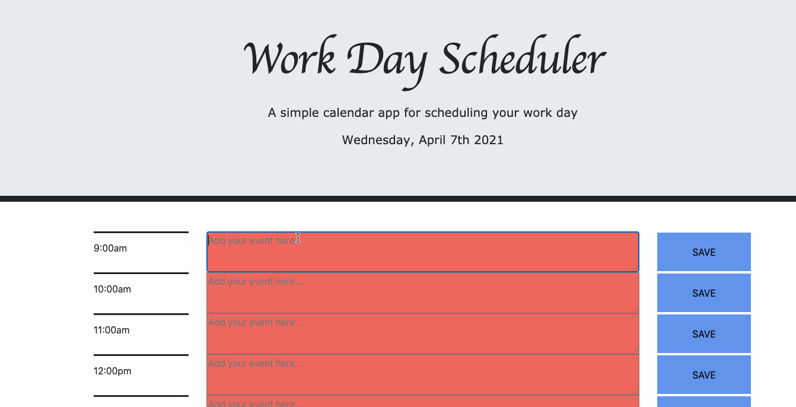

# Work Day Scheduler

## Description

This application is a work day scheduler where the user can input their todos at various hours of the day. As the day goes by, completed tasks will appear in green and uncompleted tasks in red.

## User Story

    AS A employee
    I WANT be able to input my tasks for the day a specific hours in the day
    SO THAT I can stay on schedule and not miss an important task

## Criteria

    GIVEN a planner to create a schedule

    WHEN I open the planner
    THEN the current day is displayed at the top of the calendar
    WHEN I scroll down
    THEN I am presented with timeblocks for standard business hours
    WHEN I view the timeblocks for that day
    THEN each timeblock is color coded to indicate whether it is in the past, present or future
    WHEN I click into a timeblock
    THEN I can input an event
    WHEN I click the save button for that timeblock
    THEN the text for that event is saved in local storage
    WHEN the hour is passed the specific time block
    THEN the background colour of the text area turns red
    WHEN I refresh the page
    THEN the saved events persist

## Link

The link below will give you access to the web application:

https://dghazi12.github.io/davidaghazi05.github.io/

## Preview

